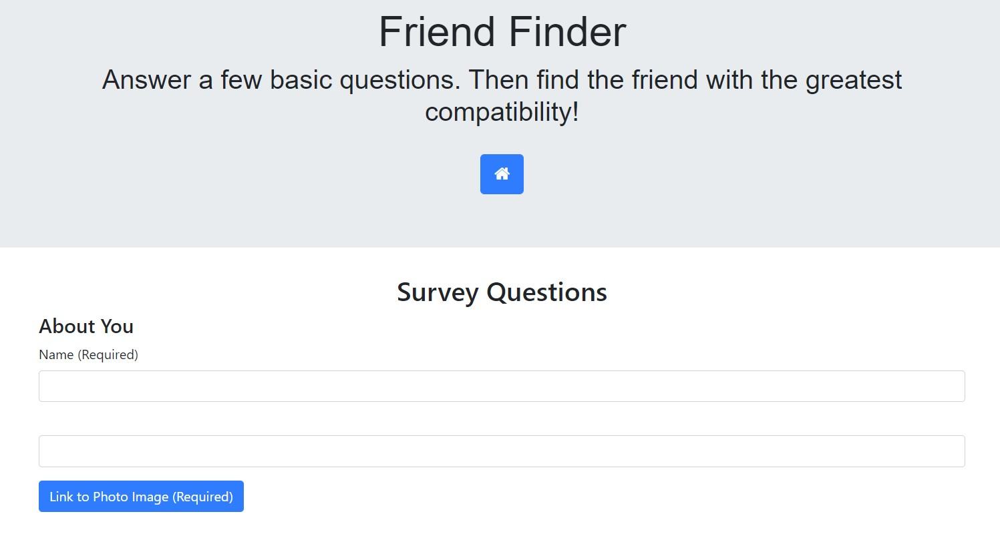
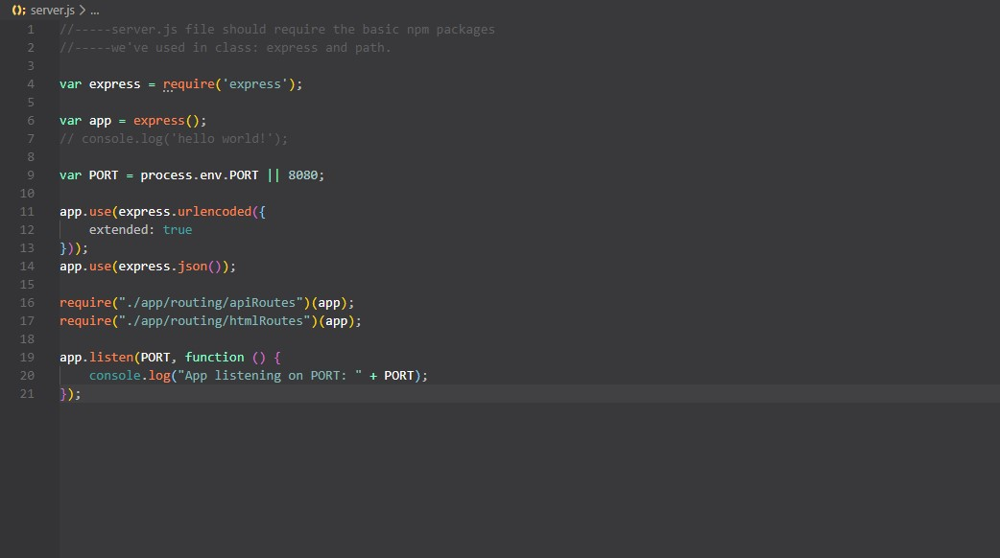

# Friend-Finder

https://thawing-springs-64595.herokuapp.com/

The 'Friend Finder' application is a full-stack website that takes a user's results from a questionaire and compares them to other 'users'.  The application will then display to the user the best overall match based on their answers.  This app utilizes Node.js and the npm packages Express and Path.  

#### Screenshots

